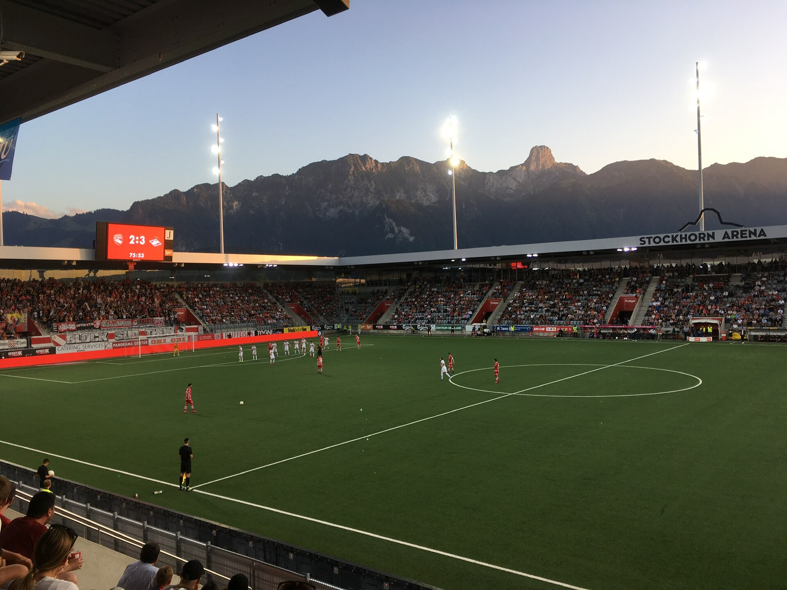
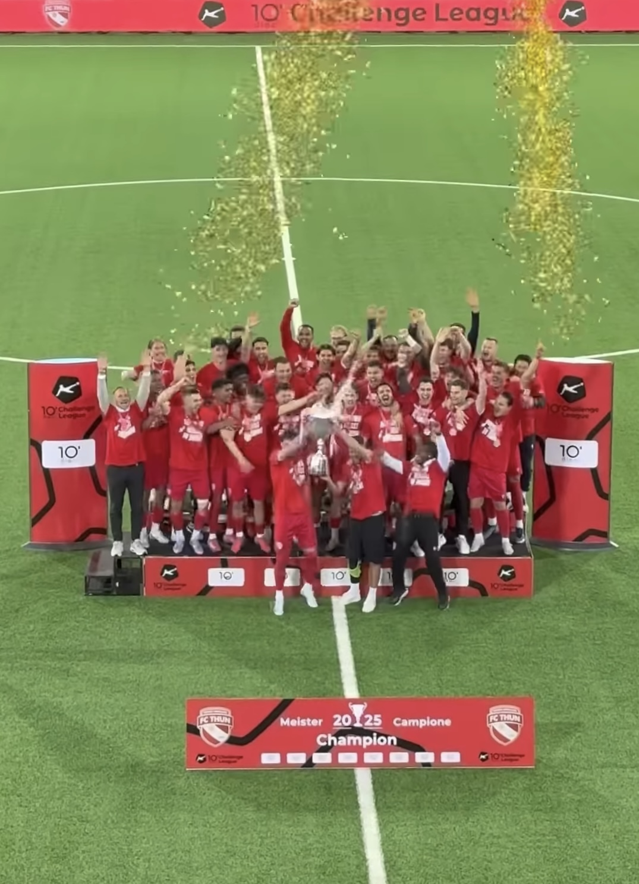

```{python}
#| echo: false
#| warning: false
#| message: false

import pandas as pd
import plotly.express as px
import plotly.graph_objects as go
from IPython.display import HTML, display

df = pd.read_csv("../data_acquisition/processed/team_season_stats_merged.csv")
df = df.sort_values("standings_points", ascending=False).reset_index(drop=True)

THUN_RED = "#E63946"
THUN_DARK = "#141414"
INK = "#202020"
MUTED = "#6f6f6f"
LIGHT = "#f5f2ed"
LINE = "#ded8ce"
GRAY = "#c9c9c9"

thun = df[df["team_name"] == "FC Thun"].iloc[0]
league_avg = df.mean(numeric_only=True)
runner_up_points = df[df["standings_rank"] == 2]["standings_points"].iloc[0]
points_gap = int(thun["standings_points"] - runner_up_points)
possession_rank = int(df["sm_ball_possession_pct"].rank(ascending=False, method="min")[df["team_name"] == "FC Thun"].iloc[0])
save_rank = int(df["fbref_save_pct"].rank(ascending=False, method="min")[df["team_name"] == "FC Thun"].iloc[0])
gps_rank = int(df["fbref_goals_per_shot"].rank(ascending=False, method="min")[df["team_name"] == "FC Thun"].iloc[0])
clean_sheet_rank = int(df["stats_clean_sheet_total"].rank(ascending=False, method="min")[df["team_name"] == "FC Thun"].iloc[0])
thun_shots_per_goal = float(thun["fbref_shots"] / thun["fbref_goals"])
league_shots_per_goal = float(df["fbref_shots"].sum() / df["fbref_goals"].sum())
df["danger_per_possession"] = df["sm_dangerous_attacks"] / df["sm_ball_possession_pct"]
danger_rank = int(df["sm_dangerous_attacks"].rank(ascending=False, method="min")[df["team_name"] == "FC Thun"].iloc[0])
goals_rank = int(df["fbref_goals"].rank(ascending=False, method="min")[df["team_name"] == "FC Thun"].iloc[0])
danger_eff_rank = int(df["danger_per_possession"].rank(ascending=False, method="min")[df["team_name"] == "FC Thun"].iloc[0])

def team_colors(names):
    return [THUN_RED if name == "FC Thun" else GRAY for name in names]

def story_layout(fig, height=500, title=None):
    fig.update_layout(
        height=height,
        title=title,
        title_font=dict(size=20, color=INK, family="Arial Black, Arial, sans-serif"),
        font=dict(family="Arial, sans-serif", color=INK),
        plot_bgcolor="white",
        paper_bgcolor="white",
        margin=dict(l=28, r=28, t=72 if title else 36, b=36),
        hoverlabel=dict(bgcolor="white", font_size=13),
    )
    return fig
```

```{=html}
<style>
  .quarto-title-block { display: none; }
  #quarto-sidebar,
  .sidebar,
  .sidebar-navigation,
  #quarto-margin-sidebar {
    display: none !important;
  }
  body {
    overflow-x: hidden;
  }
  #quarto-content,
  #quarto-document-content,
  main.content.page-columns {
    display: block !important;
    width: 100% !important;
    max-width: none !important;
  }
  main.content {
    max-width: none !important;
    width: 100% !important;
    margin: 0 !important;
    padding: 0 !important;
  }
  .story-wrap {
    --thun-red: #E63946;
    --ink: #202020;
    --muted: #6f6f6f;
    --paper: #fbfaf7;
    --sand: #f5f2ed;
    --line: #ded8ce;
    background: var(--paper);
    color: var(--ink);
    font-family: Arial, Helvetica, sans-serif;
    width: 100%;
  }
  .story-wrap.page-columns,
  .story-wrap.page-full {
    display: block !important;
    width: 100% !important;
    max-width: none !important;
  }
  .story-wrap .cell.page-columns,
  .story-wrap .cell-output.page-columns,
  .story-wrap .cell-output-display.page-columns {
    display: block !important;
    width: 100% !important;
    max-width: none !important;
  }
  .story-wrap h1,
  .story-wrap h2,
  .story-wrap h3 {
    letter-spacing: 0;
  }
  .story-wrap .anchorjs-link {
    display: none;
  }
  .story-hero {
    min-height: 78vh;
    position: relative;
    display: flex;
    align-items: flex-end;
    overflow: hidden;
    background: #111;
  }
  .story-hero img {
    position: absolute;
    inset: 0;
    width: 100%;
    height: 100%;
    object-fit: cover;
    filter: brightness(0.45) contrast(1.08);
  }
  .story-hero::after {
    content: "";
    position: absolute;
    inset: 0;
    background: linear-gradient(180deg, rgba(0,0,0,.15) 20%, rgba(0,0,0,.86) 100%);
  }
  .hero-copy {
    position: relative;
    z-index: 1;
    width: min(900px, calc(100% - 40px));
    margin: 0 auto 8vh auto;
    color: white;
  }
  .eyebrow {
    color: var(--thun-red);
    font-size: .82rem;
    font-weight: 800;
    letter-spacing: 2px;
    text-transform: uppercase;
    margin-bottom: 14px;
  }
  .hero-copy h1 {
    font-size: clamp(2.8rem, 6vw, 5.8rem);
    line-height: .92;
    margin: 0 0 22px 0;
    font-weight: 950;
    max-width: 900px;
  }
  .hero-copy p {
    font-size: clamp(1.05rem, 2vw, 1.45rem);
    line-height: 1.45;
    max-width: 720px;
    color: #efefef;
    margin: 0;
  }
  .chapter {
    max-width: 980px;
    margin: 0 auto;
    padding: 64px 20px;
  }
  .chapter.tight { padding-top: 42px; }
  .chapter-head {
    display: grid;
    grid-template-columns: 86px 1fr;
    gap: 24px;
    align-items: start;
    margin-bottom: 28px;
  }
  .chapter-number {
    color: var(--thun-red);
    font-size: 4rem;
    line-height: .85;
    font-weight: 950;
  }
  .chapter h2 {
    font-size: clamp(2rem, 3.4vw, 3.05rem);
    line-height: 1.05;
    margin: 0;
    font-weight: 950;
  }
  .lead {
    font-size: 1.18rem;
    line-height: 1.75;
    max-width: 760px;
    color: #2d2d2d;
  }
  .muted { color: var(--muted); }
  .stat-grid {
    display: grid;
    grid-template-columns: repeat(3, 1fr);
    gap: 14px;
    margin: 34px 0;
  }
  .stat-card {
    border-top: 3px solid var(--thun-red);
    background: white;
    padding: 22px;
    min-height: 128px;
    box-shadow: 0 10px 24px rgba(0,0,0,.06);
  }
  .stat-value {
    color: var(--thun-red);
    font-size: 2.45rem;
    line-height: 1;
    font-weight: 950;
    margin-bottom: 10px;
  }
  .stat-label {
    color: var(--muted);
    font-size: .93rem;
    line-height: 1.35;
  }
  .pullquote {
    margin: 38px 0;
    padding: 26px 30px;
    background: #191919;
    color: white;
    border-left: 7px solid var(--thun-red);
    font-size: clamp(1.25rem, 2.4vw, 1.75rem);
    line-height: 1.35;
    font-weight: 800;
  }
  .note {
    background: white;
    border: 1px solid var(--line);
    padding: 18px 22px;
    color: var(--muted);
    font-size: .95rem;
    line-height: 1.55;
  }
  .table-shell {
    max-width: 980px;
    margin: 10px auto 36px auto;
    padding: 0 20px;
  }
  .league-table {
    width: 100%;
    border-collapse: collapse;
    background: white;
    box-shadow: 0 10px 24px rgba(0,0,0,.06);
    font-size: .95rem;
  }
  .league-table th {
    padding: 12px 10px;
    text-align: right;
    color: var(--muted);
    border-bottom: 1px solid var(--line);
    font-size: .78rem;
    letter-spacing: 1px;
    text-transform: uppercase;
  }
  .league-table th.team-col,
  .league-table td.team-col {
    text-align: left;
  }
  .league-table td {
    padding: 12px 10px;
    text-align: right;
    border-bottom: 1px solid #eee9df;
    vertical-align: middle;
  }
  .league-table tr.thun-row {
    background: #fff1f2;
    color: #111;
    font-weight: 850;
  }
  .league-table tr.thun-row td {
    border-top: 2px solid var(--thun-red);
    border-bottom: 2px solid var(--thun-red);
  }
  .rank-badge {
    display: inline-flex;
    align-items: center;
    justify-content: center;
    width: 28px;
    height: 28px;
    background: #efefef;
    color: #222;
    font-weight: 850;
  }
  .thun-row .rank-badge {
    background: var(--thun-red);
    color: white;
  }
  .points-cell {
    min-width: 150px;
  }
  .points-wrap {
    display: grid;
    grid-template-columns: 38px 1fr;
    gap: 10px;
    align-items: center;
  }
  .points-track {
    height: 8px;
    background: #eee9df;
    overflow: hidden;
  }
  .points-bar {
    height: 100%;
    background: #b9b3aa;
  }
  .thun-row .points-bar {
    background: var(--thun-red);
  }
  .table-caption {
    margin-top: 12px;
    color: var(--muted);
    font-size: .9rem;
    line-height: 1.45;
  }
  .visual-shell {
    max-width: 980px;
    margin: 8px auto 34px auto;
    padding: 0 20px;
  }
  .story-wrap .plotly-graph-div {
    max-width: 980px;
    margin-left: auto !important;
    margin-right: auto !important;
  }
  .story-wrap .js-plotly-plot {
    max-width: 980px;
    margin-left: auto;
    margin-right: auto;
  }
  .story-wrap .modebar {
    opacity: .35;
  }
  .moment-card {
    background: white;
    box-shadow: 0 10px 24px rgba(0,0,0,.06);
    padding: 28px;
  }
  .metric-pair {
    display: grid;
    grid-template-columns: 1fr 1fr;
    gap: 18px;
    margin-bottom: 24px;
  }
  .metric-box {
    border-top: 3px solid #b9b3aa;
    background: #fbfaf7;
    padding: 20px;
  }
  .metric-box.thun {
    border-top-color: var(--thun-red);
    background: #fff1f2;
  }
  .metric-box .big {
    display: block;
    font-size: clamp(2.5rem, 6vw, 4.8rem);
    line-height: .9;
    font-weight: 950;
    color: #191919;
  }
  .metric-box.thun .big {
    color: var(--thun-red);
  }
  .metric-box .small {
    display: block;
    margin-top: 10px;
    color: var(--muted);
    font-size: .95rem;
    line-height: 1.35;
  }
  .shot-row {
    display: grid;
    grid-template-columns: 130px 1fr;
    gap: 16px;
    align-items: center;
    margin: 12px 0;
  }
  .shot-label {
    font-weight: 850;
  }
  .shot-track {
    height: 14px;
    background: #eee9df;
    position: relative;
  }
  .shot-fill {
    height: 100%;
    background: #b9b3aa;
  }
  .shot-fill.thun {
    background: var(--thun-red);
  }
  .hundred-grid {
    display: grid;
    grid-template-columns: repeat(20, 1fr);
    gap: 5px;
    margin: 24px 0 8px 0;
  }
  .save-dot {
    aspect-ratio: 1;
    background: #e4dfd6;
  }
  .save-dot.saved {
    background: var(--thun-red);
  }
  .formula-board {
    display: grid;
    grid-template-columns: 1fr auto 1fr auto 1fr auto 1fr;
    gap: 12px;
    align-items: stretch;
    margin-top: 24px;
  }
  .formula-tile,
  .formula-result {
    background: white;
    box-shadow: 0 10px 24px rgba(0,0,0,.06);
    padding: 22px;
    min-height: 160px;
    display: flex;
    flex-direction: column;
    justify-content: space-between;
  }
  .formula-tile strong,
  .formula-result strong {
    color: var(--thun-red);
    font-size: 2.2rem;
    line-height: 1;
  }
  .formula-tile span,
  .formula-result span {
    color: var(--muted);
    line-height: 1.35;
    margin-top: 12px;
  }
  .formula-op {
    align-self: center;
    color: var(--thun-red);
    font-size: 2rem;
    font-weight: 950;
  }
  .formula-result {
    background: #191919;
    color: white;
  }
  .formula-result span {
    color: #e8e8e8;
  }
  .rank-jump {
    display: grid;
    grid-template-columns: repeat(4, 1fr);
    gap: 14px;
    margin-top: 28px;
  }
  .rank-card {
    background: white;
    box-shadow: 0 10px 24px rgba(0,0,0,.06);
    padding: 22px;
    min-height: 170px;
    display: flex;
    flex-direction: column;
    justify-content: space-between;
    border-top: 3px solid #b9b3aa;
  }
  .rank-card.thun {
    border-top-color: var(--thun-red);
    background: #fff1f2;
  }
  .rank-card .rank-label {
    color: var(--muted);
    font-size: .9rem;
    line-height: 1.3;
  }
  .rank-card .rank-value {
    font-size: clamp(2.8rem, 6vw, 4.6rem);
    line-height: .9;
    font-weight: 950;
    color: #191919;
  }
  .rank-card.thun .rank-value {
    color: var(--thun-red);
  }
  .rank-card .rank-note {
    color: var(--muted);
    font-size: .86rem;
    line-height: 1.35;
  }
  .streak-scrolly {
    width: min(1500px, calc(100vw - 72px)) !important;
    max-width: none !important;
    margin: 8px auto 72px auto !important;
    padding: 0 28px;
    position: relative;
    box-sizing: border-box;
    display: block !important;
  }
  .story-wrap .streak-scrolly.page-columns,
  .story-wrap .streak-scrolly.page-full {
    display: block !important;
    width: min(1500px, calc(100vw - 72px)) !important;
    max-width: none !important;
  }
  .streak-header-card {
    background: #191919;
    color: white;
    padding: 26px 30px;
    box-shadow: 0 14px 34px rgba(0,0,0,.16);
    margin-bottom: 18px;
  }
  .streak-kicker {
    color: var(--thun-red);
    font-size: .78rem;
    font-weight: 850;
    letter-spacing: 1.6px;
    text-transform: uppercase;
    margin-bottom: 10px;
  }
  .streak-header-card h3 {
    color: white;
    font-size: clamp(2.4rem, 4vw, 4.45rem);
    line-height: 1;
    margin: 0 0 12px 0;
    font-weight: 950;
    white-space: nowrap;
  }
  .streak-meta {
    color: #d8d8d8;
    line-height: 1.45;
    margin: 0 0 24px 0;
  }
  .streak-header-grid {
    display: grid;
    grid-template-columns: minmax(420px, 1.15fr) minmax(340px, 1.15fr) minmax(220px, .7fr);
    gap: 24px;
    align-items: end;
  }
  .streak-scoreline {
    display: grid;
    grid-template-columns: repeat(10, 1fr);
    gap: 6px;
    margin: 24px 0;
  }
  .streak-dot {
    height: 36px;
    background: rgba(255,255,255,.16);
    border-bottom: 4px solid rgba(255,255,255,.32);
  }
  .streak-dot.key {
    background: var(--thun-red);
    border-bottom-color: white;
  }
  .streak-total {
    display: grid;
    grid-template-columns: repeat(3, 1fr);
    gap: 10px;
  }
  .streak-total div {
    border-top: 1px solid rgba(255,255,255,.2);
    padding-top: 10px;
  }
  .streak-total strong {
    display: block;
    color: white;
    font-size: 1.75rem;
    line-height: 1;
  }
  .streak-total span {
    display: block;
    color: #bdbdbd;
    font-size: .78rem;
    margin-top: 5px;
  }
  .streak-card-track {
    display: flex;
    gap: 24px;
    overflow-x: auto;
    scroll-snap-type: x mandatory;
    padding: 40px 10px 42px 10px;
    -webkit-overflow-scrolling: touch;
    position: relative;
  }
  .streak-card-track::before {
    content: "";
    position: absolute;
    left: 4px;
    right: 4px;
    top: 18px;
    height: 3px;
    background: linear-gradient(90deg, var(--thun-red), #191919);
    opacity: .9;
  }
  .streak-card-track::-webkit-scrollbar {
    height: 10px;
  }
  .streak-card-track::-webkit-scrollbar-track {
    background: #eee9df;
  }
  .streak-card-track::-webkit-scrollbar-thumb {
    background: var(--thun-red);
  }
  .streak-card {
    flex: 0 0 clamp(380px, 29vw, 445px);
    scroll-snap-align: start;
    background: linear-gradient(180deg, #ffffff 0%, #fbfaf7 100%);
    box-shadow: 0 14px 34px rgba(0,0,0,.10);
    border: 1px solid #eee4da;
    border-top: 7px solid #d6d0c7;
    padding: 0;
    min-height: 372px;
    display: flex;
    flex-direction: column;
    justify-content: space-between;
    position: relative;
    overflow: hidden;
    transition: transform .22s ease, box-shadow .22s ease, border-color .22s ease, filter .22s ease;
  }
  .streak-card.key {
    border-top-color: var(--thun-red);
  }
  .streak-card:hover,
  .streak-card:focus-within {
    transform: translateY(-18px) scale(1.035);
    box-shadow: 0 34px 70px rgba(0,0,0,.22);
    z-index: 5;
    filter: saturate(1.05);
    border-top-color: #191919;
  }
  .streak-card:hover .streak-score,
  .streak-card:focus-within .streak-score {
    text-shadow: 0 10px 28px rgba(230,57,70,.18);
  }
  .streak-card::before,
  .streak-card::after {
    content: "";
    position: absolute;
    top: 72px;
    width: 24px;
    height: 24px;
    border-radius: 50%;
    background: var(--paper);
    border: 1px solid #eee4da;
    z-index: 2;
  }
  .streak-card::before {
    left: -13px;
  }
  .streak-card::after {
    right: -13px;
  }
  .ticket-top {
    padding: 20px 22px 16px 22px;
    border-bottom: 1px dashed #d9d1c6;
    background: #fff;
  }
  .ticket-body {
    padding: 20px 22px 22px 22px;
    flex: 1;
    display: flex;
    flex-direction: column;
    justify-content: space-between;
  }
  .streak-card-top {
    display: flex;
    justify-content: space-between;
    gap: 16px;
    align-items: start;
    margin-bottom: 20px;
  }
  .streak-card-label {
    color: var(--thun-red);
    font-size: .82rem;
    font-weight: 850;
    letter-spacing: 1.3px;
    text-transform: uppercase;
  }
  .streak-card-date {
    color: var(--muted);
    font-size: .9rem;
    white-space: nowrap;
  }
  .streak-card h4 {
    font-size: clamp(1.85rem, 3vw, 2.85rem);
    line-height: 1.02;
    margin: 10px 0 12px 0;
    font-weight: 950;
    overflow-wrap: anywhere;
    hyphens: auto;
  }
  .streak-score {
    color: var(--thun-red);
    font-size: clamp(3.25rem, 5.2vw, 4.8rem);
    line-height: .9;
    font-weight: 950;
    margin: 18px 0;
  }
  .ticket-tag {
    display: inline-flex;
    align-items: center;
    gap: 8px;
    color: #191919;
    font-size: .78rem;
    font-weight: 850;
    letter-spacing: 1px;
    text-transform: uppercase;
    margin-top: 12px;
  }
  .ticket-tag::before {
    content: "";
    width: 10px;
    height: 10px;
    background: var(--thun-red);
  }
  .streak-card p {
    color: #2d2d2d;
    font-size: .98rem;
    line-height: 1.55;
    max-width: 720px;
    margin: 0;
  }
  .formula {
    display: grid;
    grid-template-columns: repeat(3, 1fr);
    gap: 16px;
    margin: 34px 0;
  }
  .formula-step {
    background: #191919;
    color: white;
    padding: 24px;
    min-height: 180px;
  }
  .formula-step strong {
    color: var(--thun-red);
    display: block;
    font-size: 2.2rem;
    line-height: 1;
    margin-bottom: 14px;
  }
  .image-break {
    position: relative;
    min-height: 62vh;
    overflow: hidden;
    display: flex;
    align-items: center;
    justify-content: center;
    color: white;
    text-align: center;
    background: #111;
  }
  .image-break img {
    position: absolute;
    inset: 0;
    width: 100%;
    height: 100%;
    object-fit: cover;
    filter: brightness(.48) contrast(1.04);
  }
  .image-break::after {
    content: "";
    position: absolute;
    inset: 0;
    background: linear-gradient(90deg, rgba(0,0,0,.8), rgba(0,0,0,.15));
  }
  .image-break div {
    position: relative;
    z-index: 1;
    max-width: 760px;
    padding: 0 20px;
  }
  .image-break h2 {
    font-size: clamp(2.2rem, 5vw, 4.8rem);
    line-height: 1;
    margin: 0 0 18px 0;
    font-weight: 950;
  }
  .footer-note {
    max-width: 980px;
    margin: 0 auto;
    padding: 34px 20px 52px 20px;
    color: var(--muted);
    font-size: .88rem;
    border-top: 1px solid var(--line);
  }
  @media (max-width: 760px) {
    .chapter { padding: 56px 18px; }
    .chapter-head { grid-template-columns: 1fr; gap: 10px; }
    .chapter-number { font-size: 2.7rem; }
    .stat-grid, .formula { grid-template-columns: 1fr; }
    .metric-pair,
    .formula-board,
    .rank-jump {
      grid-template-columns: 1fr;
    }
    .streak-scrolly {
      width: calc(100vw - 36px) !important;
      margin: 8px auto 42px auto !important;
      padding: 0 18px;
      min-height: auto !important;
    }
    .streak-header-grid {
      grid-template-columns: 1fr;
    }
    .streak-header-card {
      padding: 24px 20px;
    }
    .streak-header-card h3 {
      white-space: normal;
      font-size: clamp(2.2rem, 12vw, 3.6rem);
    }
    .streak-scoreline {
      margin: 12px 0;
    }
    .story-wrap .streak-scrolly.page-columns,
    .story-wrap .streak-scrolly.page-full {
      width: calc(100vw - 36px) !important;
    }
    .streak-card {
      flex-basis: min(340px, 86vw);
      min-height: auto;
      min-width: 0;
    }
    .streak-card:hover,
    .streak-card:focus-within {
      transform: translateY(-8px) scale(1.015);
    }
    .streak-card h4 {
      font-size: clamp(1.8rem, 10vw, 2.55rem);
    }
    .streak-score {
      font-size: clamp(3rem, 17vw, 4.1rem);
    }
    .formula-op {
      display: none;
    }
    .shot-row {
      grid-template-columns: 1fr;
      gap: 6px;
    }
    .hundred-grid {
      grid-template-columns: repeat(10, 1fr);
    }
    .league-table {
      font-size: .82rem;
    }
    .league-table th:nth-child(4),
    .league-table th:nth-child(5),
    .league-table th:nth-child(6),
    .league-table td:nth-child(4),
    .league-table td:nth-child(5),
    .league-table td:nth-child(6) {
      display: none;
    }
    .points-cell {
      min-width: 110px;
    }
    .hero-copy { margin-bottom: 6vh; }
    .visual-shell {
      padding: 0 14px;
    }
    .story-wrap .plotly-graph-div {
      width: calc(100vw - 28px) !important;
      max-width: calc(100vw - 28px);
      height: 390px !important;
    }
    .story-wrap .modebar {
      display: none !important;
    }
  }
</style>

<div class="story-wrap">
<section class="story-hero">
  
  <div class="hero-copy">
    <div class="eyebrow">Swiss Super League 2025/26</div>
    <h1>Die Thun-Formel</h1>
    <p>74 Punkte. 14 Punkte Vorsprung. Schweizer Meister, als Aufsteiger. Während die Grossen rechneten, gewann der FC Thun einfach weiter. Die Daten zeigen: Das ist kein Zufall. Das ist Methode.</p>
  </div>
</section>
```

```{=html}
<section class="chapter tight">
  <div class="chapter-head">
    <div class="chapter-number">01</div>
    <h2>Der Club, der nicht in diese Tabelle passen sollte</h2>
  </div>
  <p class="lead">
    Sommer 2025: Der FC Thun kehrt zurück in die Super League. Das Ziel? Klassenerhalt. Vielleicht Top 6, wenn alles passt. Niemand spricht von Titel. Nicht mal in Thun selbst. Auf dem Papier ist das ein kleiner Club aus einer mittelgrossen Stadt und das waren auch die Erwartungen.
  </p>
  <div class="stat-grid">
    <div class="stat-card">
      <div class="stat-value">1898</div>
      <div class="stat-label">Gegründet. Kein Projektclub, sondern ein Verein, der zur Stadt gehört.</div>
    </div>
    <div class="stat-card">
      <div class="stat-value">10'398</div>
      <div class="stat-label">Plätze in der Stockhorn Arena. Gross genug für Lärm, klein genug, dass jeder Abend persönlich bleibt.</div>
    </div>
    <div class="stat-card">
      <div class="stat-value">CHF 16.4M</div>
      <div class="stat-label">Kaderwert zu Saisonbeginn. Im Vergleich zur Konkurrenz eher Werkzeugkiste als Luxusgarage.</div>
    </div>
  </div>
  <div class="note" style="margin-top: 16px;">
    <strong>Zum Vergleich:</strong> YB, teuerster Club der Liga: <strong>CHF 68.0M</strong>  Liga-Durchschnitt: <strong>CHF 33.1M</strong>.<br>
    <span style="font-size: 0.85em; color: var(--muted);">Quelle: Transfermarkt, März 2026. Umrechnungskurs: 1 EUR = 1.034 CHF.</span>
  </div>
  <p class="lead" style="margin-top: 24px;">
    Thun gewinnt nicht, weil es die grösste Bühne oder die teuersten Namen hat. Der Club kostet einen Bruchteil von dem, was YB oder Basel aufbieten und gewinnt trotzdem die Meisterschaft. Weil er aus seinen Momenten mehr macht als andere aus ihrer Überlegenheit.
  </p>
</section>
```

```{=html}
<section class="chapter">
  <div class="chapter-head">
    <div class="chapter-number">02</div>
    <h2>Die Tabelle als Sensation</h2>
  </div>
  <p class="lead">
    Die Geschichte beginnt nicht mit einer taktischen Feinheit, sondern mit einem Blick auf die Tabelle.
    FC Thun: Rang 1. 74 Punkte. 14 Punkte Vorsprung auf St. Gallen. Für einen frischgebackenen Aufsteiger ist das keine gute Saison, das ist eine Sensation.
  </p>
</section>
```

```{python}
#| echo: false
#| warning: false

df_table = df.sort_values("standings_rank", ascending=True).copy()
max_points = df_table["standings_points"].max()

rows = []
for _, row in df_table.iterrows():
    is_thun = row["team_name"] == "FC Thun"
    tr_class = " class=\"thun-row\"" if is_thun else ""
    points_width = float(row["standings_points"] / max_points * 100)
    team_name = row["team_name"]
    goals = f"{int(row['standings_goals_for'])}:{int(row['standings_goals_against'])}"
    goal_diff = int(row["standings_goals_diff"])
    goal_diff_label = f"+{goal_diff}" if goal_diff > 0 else str(goal_diff)
    rows.append(f"""
      <tr{tr_class}>
        <td><span class="rank-badge">{int(row['standings_rank'])}</span></td>
        <td class="team-col">{team_name}</td>
        <td>{int(row['standings_played'])}</td>
        <td>{int(row['standings_win'])}</td>
        <td>{int(row['standings_draw'])}</td>
        <td>{int(row['standings_lose'])}</td>
        <td>{goals}</td>
        <td>{goal_diff_label}</td>
        <td class="points-cell">
          <div class="points-wrap">
            <strong>{int(row['standings_points'])}</strong>
            <span class="points-track"><span class="points-bar" style="width: {points_width:.1f}%"></span></span>
          </div>
        </td>
      </tr>
    """)

display(HTML(f"""
<div class="table-shell">
  <table class="league-table">
    <thead>
      <tr>
        <th>Rang</th>
        <th class="team-col">Team</th>
        <th>Sp.</th>
        <th>S</th>
        <th>U</th>
        <th>N</th>
        <th>Tore</th>
        <th>+/-</th>
        <th>Punkte</th>
      </tr>
    </thead>
    <tbody>
      {''.join(rows)}
    </tbody>
  </table>
  <div class="table-caption">
    FC Thun steht nach 33 Spielen bei {int(thun['standings_points'])} Punkten.
    Der Vorsprung auf Rang 2 beträgt {points_gap} Punkte.
  </div>
</div>
"""))
```

```{=html}
<section class="chapter tight">
  <div class="pullquote">
    Ein Aufsteiger gewinnt nicht knapp. Er gewinnt so deutlich, dass die Tabelle selbst zur Sensation wird.
  </div>
  <p class="lead">
    Ab hier wird die Frage spannender: Nicht <em>ob</em> Thun erfolgreich ist, sondern <em>wie</em>.
    Denn wer nur nach den üblichen Zeichen von Dominanz sucht, verpasst den Kern dieser Saison.
  </p>
</section>
```

```{=html}
<section class="chapter">
  <div class="chapter-head">
    <div class="chapter-number">03</div>
    <h2>Das Ballbesitz-Paradox</h2>
  </div>
  <p class="lead">
    Dominante Teams haben oft viel Ballbesitz. Sie kontrollieren Räume, Tempo und Gegner.
    Thun erzählt eine andere Version von Kontrolle: nicht über Minuten am Ball, sondern über die Qualität der Momente.
    Der entscheidende Sprung passiert dort, wo Ballbesitz in Gefahr verwandelt wird.
  </p>
</section>
```

```{python}
#| echo: false
#| warning: false

display(HTML(f"""
<div class="visual-shell">
  <div class="moment-card">
    <div class="rank-jump">
      <div class="rank-card">
        <div class="rank-label">Ballbesitz</div>
        <div class="rank-value">#{possession_rank}</div>
        <div class="rank-note">{thun['sm_ball_possession_pct']:.1f}% im Schnitt. Nicht die Dominanzzahl eines Favoriten.</div>
      </div>
      <div class="rank-card thun">
        <div class="rank-label">Gefährliche Angriffe</div>
        <div class="rank-value">#{danger_rank}</div>
        <div class="rank-note">{thun['sm_dangerous_attacks']:.1f} pro Spiel. Aus wenig Kontrolle wird viel Druck.</div>
      </div>
      <div class="rank-card thun">
        <div class="rank-label">Gefahr pro Ballbesitz</div>
        <div class="rank-value">#{danger_eff_rank}</div>
        <div class="rank-note">Eine einfache Wirkungszahl: gefährliche Angriffe geteilt durch Ballbesitz.</div>
      </div>
      <div class="rank-card thun">
        <div class="rank-label">Tore</div>
        <div class="rank-value">#{goals_rank}</div>
        <div class="rank-note">{int(thun['fbref_goals'])} Tore. Am Ende wird aus Gefahr auch Ertrag.</div>
      </div>
    </div>
  </div>
</div>
"""))
```

```{=html}
<section class="chapter tight">
  <p class="lead">
    Das ist die eigentliche Pointe: Thun hat nicht den meisten Ball. Aber wenn Thun den Ball in die gefährlichen Zonen
    bringt, entsteht mehr Wirkung als bei jedem anderen Team der Liga.
  </p>
</section>
```

```{python}
#| echo: false
#| warning: false

plot_df = df.copy()
plot_df["highlight"] = plot_df["team_name"].where(plot_df["team_name"] == "FC Thun", "Andere Teams")
plot_df["label"] = plot_df["team_name"].where(plot_df["team_name"] == "FC Thun", "")
plot_df["possession_rank"] = plot_df["sm_ball_possession_pct"].rank(ascending=False, method="min").astype(int)
plot_df["danger_rank"] = plot_df["sm_dangerous_attacks"].rank(ascending=False, method="min").astype(int)
plot_df["danger_eff_rank"] = plot_df["danger_per_possession"].rank(ascending=False, method="min").astype(int)

fig = px.scatter(
    plot_df,
    x="sm_ball_possession_pct",
    y="sm_dangerous_attacks",
    color="highlight",
    color_discrete_map={"FC Thun": THUN_RED, "Andere Teams": GRAY},
    text="label",
    hover_name="team_name",
    custom_data=[
        "team_name",
        "possession_rank",
        "danger_rank",
        "danger_eff_rank",
        "sm_ball_possession_pct",
        "sm_dangerous_attacks",
    ],
    labels={
        "sm_ball_possession_pct": "Durchschnittlicher Ballbesitz (%)",
        "sm_dangerous_attacks": "Gefährliche Angriffe pro Spiel",
        "highlight": "",
    },
)
fig.update_traces(
    textposition="top center",
    marker=dict(size=15, line=dict(width=1.5, color="white"), opacity=0.88),
    hovertemplate=(
        "<b>%{customdata[0]}</b><br>"
        "Ballbesitz-Rang: %{customdata[1]}<br>"
        "Rang gefährliche Angriffe: %{customdata[2]}<br>"
        "Rang Gefahr pro Ballbesitz: %{customdata[3]}<br>"
        "Ballbesitz: %{customdata[4]:.1f}%<br>"
        "Gefährliche Angriffe: %{customdata[5]:.1f}<extra></extra>"
    ),
)
fig.update_layout(
    legend=dict(orientation="h", y=1.08, x=0),
    xaxis=dict(showgrid=True, gridcolor="#eee8de", zeroline=False),
    yaxis=dict(showgrid=True, gridcolor="#eee8de", zeroline=False),
)
fig.add_vline(x=league_avg["sm_ball_possession_pct"], line_dash="dot", line_color="#777")
fig.add_annotation(
    x=float(thun["sm_ball_possession_pct"]),
    y=float(thun["sm_dangerous_attacks"]),
    text=f"Rang {possession_rank} beim Ballbesitz, Rang {danger_rank} bei gefährlichen Angriffen",
    showarrow=True,
    arrowhead=2,
    ax=92,
    ay=-44,
    bgcolor="white",
    bordercolor=THUN_RED,
    font=dict(size=13, color=INK),
)
story_layout(fig, height=500, title="Wenig Ballbesitz, viel Gefahr")
fig.show()
```

```{=html}
<section class="chapter tight">
  <p class="lead">
    Der Scatterplot ist nur noch der Beleg. Die einfachere Lesart steckt in den Rängen:
    Thun ist beim Ballbesitz kein Ligaprimus, aber bei der Gefahr, die daraus entsteht, ganz vorne.
  </p>
  <div class="note">
    Lesart: Die gestrichelte Linie markiert den Liga-Durchschnitt beim Ballbesitz.
    Thun steht weit oben, aber nicht weit rechts. Genau dort liegt das Paradox.
  </div>
</section>
```

```{=html}
<section class="chapter">
  <div class="chapter-head">
    <div class="chapter-number">04</div>
    <h2>Vorne zählt jeder Abschluss</h2>
  </div>
  <p class="lead">
    Weniger Ballbesitz heisst: Wenn Thun zum Abschluss kommt, muss er sitzen. Und er sitzt. Mit 7.7 Schüssen pro Tor ist der FC Thun die zweiteffizienteste Mannschaft der Liga, nur übertroffen von den BSC Young Boys mit 7.5
  </p>
</section>
```

```{python}
#| echo: false
#| warning: false

# Shots per goal ranking for all teams
df["shots_per_goal"] = df["fbref_shots"] / df["fbref_goals"]
df_eff = df[["team_name", "shots_per_goal"]].sort_values("shots_per_goal", ascending=True).copy()
df_eff["rank"] = range(1, len(df_eff) + 1)

# Football icon rows: Thun vs Liga
thun_spg = thun_shots_per_goal  # ~7.7
league_spg = float(df["fbref_shots"].sum() / df["fbref_goals"].sum())  # ~9.2
thun_n = round(thun_spg)
league_n = round(league_spg)

def make_ball_row(n, highlight_at):
    balls = []
    for i in range(1, n + 1):
        if i == highlight_at:
            balls.append('<span style="font-size:1.5rem;">⚽</span>')
        else:
            balls.append('<span style="font-size:1.5rem; opacity:0.25;">⚽</span>')
    return "".join(balls)

thun_balls = make_ball_row(thun_n, thun_n)
league_balls = make_ball_row(league_n, league_n)

# All-team ranking bars
bar_rows = []
max_spg = df_eff["shots_per_goal"].max()
for _, r in df_eff.iterrows():
    is_thun = r["team_name"] == "FC Thun"
    color = "#E63946" if is_thun else "#c9c9c9"
    width_pct = r["shots_per_goal"] / max_spg * 100
    weight = "font-weight:700;" if is_thun else ""
    bar_rows.append(f"""
      <div style="display:flex; align-items:center; gap:10px; margin-bottom:5px;">
        <div style="width:140px; font-size:.85rem; text-align:right; {weight} color:#202020;">{r['team_name']}</div>
        <div style="flex:1; background:#f0ede8; border-radius:3px; height:18px;">
          <div style="width:{width_pct:.1f}%; background:{color}; height:18px; border-radius:3px;"></div>
        </div>
        <div style="width:36px; font-size:.85rem; {weight} color:#202020;">{r['shots_per_goal']:.1f}</div>
      </div>
    """)

display(HTML(f"""
<div class="visual-shell">
  <div class="moment-card">

    <!-- Element 1: Grosse Zahl -->
    <div style="text-align:center; margin-bottom:28px;">
      <div style="font-size:3.8rem; font-weight:900; color:#E63946; line-height:1;">{thun_spg:.1f}</div>
      <div style="font-size:1rem; color:#202020; margin-top:4px;">Schüsse pro Tor: <strong>Platz 1 in der Super League</strong></div>
      <div style="font-size:.88rem; color:#6f6f6f; margin-top:2px;">Liga-Durchschnitt: {league_spg:.1f} Schüsse pro Tor</div>
    </div>

    <!-- Element 2: Icon-Vergleich -->
    <div style="background:#f5f2ed; border-radius:8px; padding:18px 20px; margin-bottom:24px;">
      <div style="display:grid; grid-template-columns:1fr 1fr; gap:16px;">
        <div style="text-align:center;">
          <div style="font-size:.8rem; font-weight:700; color:#E63946; margin-bottom:8px; text-transform:uppercase; letter-spacing:.05em;">FC Thun</div>
          <div style="line-height:2;">{thun_balls}</div>
          <div style="font-size:.82rem; color:#6f6f6f; margin-top:8px;">1 Tor pro <strong>{thun_n} Schüsse</strong></div>
        </div>
        <div style="text-align:center;">
          <div style="font-size:.8rem; font-weight:700; color:#6f6f6f; margin-bottom:8px; text-transform:uppercase; letter-spacing:.05em;">Liga-Ø</div>
          <div style="line-height:2;">{league_balls}</div>
          <div style="font-size:.82rem; color:#6f6f6f; margin-top:8px;">1 Tor pro <strong>{league_n} Schüsse</strong></div>
        </div>
      </div>
    </div>

    <!-- Element 3: Liga-Ranking -->
    <div style="font-size:.8rem; font-weight:700; color:#6f6f6f; text-transform:uppercase; letter-spacing:.05em; margin-bottom:10px;">
      Schüsse pro Tor von allen Teams (weniger = effizienter)
    </div>
    {''.join(bar_rows)}
    <div class="table-caption" style="margin-top:12px;">
      Thun erzielte 75 Tore aus 578 Schüssen
    </div>
  </div>
</div>
"""))
```

```{=html}
<section class="chapter tight">
  <p class="lead">
    Das ist der Unterschied zwischen Druck und Wirkung. Nicht das Team mit den meisten Abschlüssen gewinnt, sondern das Team, das aus seinen Abschlüssen am meisten macht. Für die Fans auf den Rängen fühlt sich das nach Kaltschnäuzigkeit an. In den Daten sieht es aus wie ein klares Muster.
  </p>
</section>
```

```{=html}
<section class="chapter">
  <div class="chapter-head">
    <div class="chapter-number">05</div>
    <h2>Hinten hält die Saison</h2>
  </div>
  <p class="lead">
    Eine Underdog-Saison kippt schnell, wenn sie defensiv wackelt. Thun kippt nicht weil Niklas Steffen im Tor steht. Von 100 Schüssen aufs Tor hält er 76. Nur Lugano liegt in dieser Kennzahl noch knapp vor ihm.
  </p>
</section>
```

```{python}
#| echo: false
#| warning: false

# Save % ranking for all teams
df_saves = df[["team_name", "fbref_save_pct"]].sort_values("fbref_save_pct", ascending=False).copy()
max_save = df_saves["fbref_save_pct"].max()

save_bar_rows = []
for _, r in df_saves.iterrows():
    is_thun = r["team_name"] == "FC Thun"
    color = "#E63946" if is_thun else "#c9c9c9"
    width_pct = r["fbref_save_pct"] / max_save * 100
    weight = "font-weight:700;" if is_thun else ""
    save_bar_rows.append(f"""
      <div style="display:flex; align-items:center; gap:10px; margin-bottom:5px;">
        <div style="width:140px; font-size:.85rem; text-align:right; {weight} color:#202020;">{r['team_name']}</div>
        <div style="flex:1; background:#f0ede8; border-radius:3px; height:18px;">
          <div style="width:{width_pct:.1f}%; background:{color}; height:18px; border-radius:3px;"></div>
        </div>
        <div style="width:46px; font-size:.85rem; {weight} color:#202020;">{r['fbref_save_pct']:.1f}%</div>
      </div>
    """)

display(HTML(f"""
<div class="visual-shell">
  <div class="moment-card">
    <!-- Grosse Zahl -->
    <div style="text-align:center; margin-bottom:28px;">
      <div style="font-size:3.8rem; font-weight:900; color:#E63946; line-height:1;">{thun['fbref_save_pct']:.1f}%</div>
      <div style="font-size:1rem; color:#202020; margin-top:4px;"><strong>Niklas Steffen</strong> Paradequote, Rang {save_rank} der Liga</div>
      <div style="font-size:.88rem; color:#6f6f6f; margin-top:2px;">Liga-Durchschnitt: {league_avg['fbref_save_pct']:.1f}%</div>
    </div>
    <!-- Liga-Ranking -->
    <div style="font-size:.8rem; font-weight:700; color:#6f6f6f; text-transform:uppercase; letter-spacing:.05em; margin-bottom:10px;">
      Save % von allen Teams (mehr = besser)
    </div>
    {''.join(save_bar_rows)}
    <div class="table-caption" style="margin-top:12px;">
      Steffen hielt in der Saison 103 von 140 Schüssen. Nur Lugano liegt knapp höher.
    </div>
  </div>
</div>
"""))
```

```{=html}
<section class="chapter tight">
  <div class="pullquote">
    Was im Stadion wie Kampfgeist aussieht, zeigt sich in den Daten als Muster:
    vorne wenig verschwenden, hinten wenig verschenken.
  </div>
</section>
```

```{=html}
<section class="chapter">
  <div class="chapter-head">
    <div class="chapter-number">06</div>
    <h2>Die Serie: 10 Siege am Stück</h2>
  </div>
  <p class="lead">
    Thun spielt konstant gut. Aber im Herbst 2025 passiert etwas, das die Saison endgültig kippt: 10 Siege in Folge. Kein einziges Unentschieden, keine einzige Niederlage. Der Schlüsselmoment dieser Meisterschaft.
  </p>
</section>
```

```{python}
#| echo: false
#| warning: false

import pandas as pd
from IPython.display import HTML, display

fixtures = pd.read_csv("../data_acquisition/raw/footballapi/fixtures_footballapi.csv")

# FC Thun matches, determine result
thun_matches = []
for _, row in fixtures.iterrows():
    if row["home_team_name"] == "FC Thun":
        goals_for = row["goals_home"]
        goals_against = row["goals_away"]
        opponent = row["away_team_name"]
        venue = "H"
    elif row["away_team_name"] == "FC Thun":
        goals_for = row["goals_away"]
        goals_against = row["goals_home"]
        opponent = row["home_team_name"]
        venue = "A"
    else:
        continue

    # Skip matches without result data
    if pd.isna(goals_for) or pd.isna(goals_against):
        continue

    if goals_for > goals_against:
        result = "W"
    elif goals_for == goals_against:
        result = "D"
    else:
        result = "L"

    thun_matches.append({
        "date": pd.to_datetime(row["date"]).strftime("%d.%m.%Y"),
        "date_raw": pd.to_datetime(row["date"]),
        "round": row["round"].replace("Regular Season - ", "Runde "),
        "opponent": opponent,
        "goals_for": int(goals_for),
        "goals_against": int(goals_against),
        "result": result,
        "venue": venue,
    })

thun_df = pd.DataFrame(thun_matches).sort_values("date_raw").reset_index(drop=True)

# Find the longest win streak
max_streak = 0
max_start = 0
cur_streak = 0
cur_start = 0
for i, row in thun_df.iterrows():
    if row["result"] == "W":
        if cur_streak == 0:
            cur_start = i
        cur_streak += 1
        if cur_streak > max_streak:
            max_streak = cur_streak
            max_start = cur_start
    else:
        cur_streak = 0

streak_df = thun_df.iloc[max_start : max_start + max_streak].copy().reset_index(drop=True)

start_date = streak_df.iloc[0]["date"]
end_date = streak_df.iloc[-1]["date"]
total_goals_for = int(streak_df["goals_for"].sum())
total_goals_against = int(streak_df["goals_against"].sum())

def short_opponent(name):
    return name.replace("FC ", "").replace("BSC ", "").replace("1893", "").strip()

def pick_first(mask):
    matches = streak_df[mask]
    if matches.empty:
        return None
    return matches.index[0]

key_indices = []
for idx in [
    0,
    pick_first(streak_df["opponent"].str.contains("Zurich", case=False, na=False)),
    pick_first(streak_df["opponent"].str.contains("Young Boys", case=False, na=False)),
    pick_first(streak_df["opponent"].str.contains("Basel", case=False, na=False)),
    pick_first(streak_df["opponent"].str.contains("Lausanne", case=False, na=False)),
    pick_first(streak_df["opponent"].str.contains("Sion", case=False, na=False)),
    max_streak - 1,
]:
    if idx is not None and idx not in key_indices:
        key_indices.append(idx)

story_text = {
    0: ("Startschuss", "Der erste Sieg wirkt noch wie ein starker Abend. Noch nicht wie der Beginn einer Serie."),
    pick_first(streak_df["opponent"].str.contains("Zurich", case=False, na=False)): (
        "Bestätigung",
        "Noch einmal vier Tore. Thun gewinnt nicht nur, Thun bleibt gefährlich. Aus einem guten Abend wird ein Muster.",
    ),
    pick_first(streak_df["opponent"].str.contains("Young Boys", case=False, na=False)): (
        "Die Ansage",
        "Gegen YB wird die Serie zur Botschaft. Wer den grossen Vergleichsclub 4:1 schlägt, ist nicht mehr nur Aufsteiger.",
    ),
    pick_first(streak_df["opponent"].str.contains("Basel", case=False, na=False)): (
        "Reifeprüfung",
        "Auswärts bei Basel reicht auch ein knappes 2:1. Nicht jeder Sieg muss glänzen. Manche zeigen, dass ein Team erwachsen geworden ist.",
    ),
    pick_first(streak_df["opponent"].str.contains("Lausanne", case=False, na=False)): (
        "Machtdemonstration",
        "Das 5:1 ist der lauteste Moment der Serie. Thun kann nicht nur effizient sein, sondern auch überrollen.",
    ),
    pick_first(streak_df["opponent"].str.contains("Sion", case=False, na=False)): (
        "Nervenspiel",
        "Ein 1:0 ist kein Feuerwerk. Aber genau solche Spiele entscheiden Meisterschaften: wenig Raum, wenig Fehler, drei Punkte.",
    ),
    max_streak - 1: (
        "Der zehnte Schritt",
        "Mit dem letzten Sieg wird aus Form ein Lauf. Zehn Spiele, zehn Siege, 31:9 Tore. Der Aufsteiger hat die Liga gezwungen, neu hinzuschauen.",
    ),
}

dots = []
for idx, (_, g) in enumerate(streak_df.iterrows()):
    dot_class = "streak-dot key" if idx in key_indices else "streak-dot"
    dots.append(f'<div class="{dot_class}" title="{g["date"]}: {short_opponent(g["opponent"])} {g["goals_for"]}:{g["goals_against"]}"></div>')

moments = []
for idx in key_indices:
    g = streak_df.iloc[idx]
    label, text = story_text.get(idx, ("Schlüsselmoment", "Ein weiterer Sieg in einer Serie, die Thuns Saison endgültig prägt."))
    venue_label = "Heim" if g["venue"] == "H" else "Auswärts"
    moments.append({
        "label": f"{label} · Sieg {idx + 1}/{max_streak}",
        "date": f"{g['date']} · {venue_label}",
        "opponent": short_opponent(g["opponent"]),
        "score": f"{int(g['goals_for'])}:{int(g['goals_against'])}",
        "text": text,
    })

import json
moments_json = json.dumps(moments, ensure_ascii=False)
initial = moments[0]
cards_html = []
for moment in moments:
    tag = moment["label"].split(" · ")[0]
    cards_html.append(f"""
        <article class="streak-card key">
          <div class="ticket-top">
            <div class="streak-card-top">
              <div class="streak-card-label">{moment['label']}</div>
              <div class="streak-card-date">{moment['date']}</div>
            </div>
          </div>
          <div class="ticket-body">
            <div>
              <div class="ticket-tag">{tag}</div>
              <h4>{moment['opponent']}</h4>
              <div class="streak-score">{moment['score']}</div>
            </div>
            <p>{moment['text']}</p>
          </div>
        </article>
    """)

display(HTML(f"""
<div class="streak-scrolly">
  <section class="streak-header-card">
    <div class="streak-header-grid">
      <div>
        <div class="streak-kicker">Der Meisterlauf</div>
        <h3>{max_streak} Siege am Stück</h3>
        <p class="streak-meta">{start_date} bis {end_date}<br>Die Schlüsselmomente als horizontale Timeline.</p>
      </div>
      <div class="streak-scoreline">{''.join(dots)}</div>
      <div class="streak-total">
        <div><strong>{total_goals_for}</strong><span>Tore</span></div>
        <div><strong>{total_goals_against}</strong><span>Gegentore</span></div>
        <div><strong>{max_streak}/10</strong><span>Siege</span></div>
      </div>
    </div>
  </section>
  <div class="streak-card-track" aria-label="Schlüsselmomente der Siegesserie">
    {''.join(cards_html)}
  </div>
  <div class="table-caption" style="padding-left:4px;">
    Horizontal scrollen, um die Schlüsselmomente der Serie zu lesen. Die roten Balken oben markieren die erzählten Spiele.
  </div>
</div>
"""))
```

```{=html}
<section class="chapter tight">
  <p class="lead">
    Diese Serie ist nicht Glück, sie ist Ausdruck von allem, was Thun in dieser Saison auszeichnet. Effizienz vorne, Stabilität hinten, und ein Team, das sich nicht beirren lässt.
  </p>
</section>
```

```{=html}
<section class="chapter">
  <div class="chapter-head">
    <div class="chapter-number">07</div>
    <h2>Die Arbeit zwischen den Highlights</h2>
  </div>
  <p class="lead">
    Effizienz vorne, Stabilität hinten, aber was passiert dazwischen? Das Netzdiagramm zeigt, wie FC Thun im Vergleich zum Liga-Durchschnitt aufgestellt ist: Gefährliche Angriffe, Schüsse, Tackles, Angriffe total, Tordifferenz.
  </p>
</section>
```

```{python}
#| echo: false
#| warning: false

radar_metrics = [
    ("sm_dangerous_attacks", "Gefährliche\nAngriffe"),
    ("sm_shots", "Schüsse"),
    ("fbref_tackles_won", "Tackles\ngewonnen"),
    ("sm_attacks", "Angriffe\ntotal"),
    ("standings_goals_diff", "Tor-\ndifferenz"),
]

categories = [m[1] for m in radar_metrics]
thun_vals = []
league_vals = []
for col, _ in radar_metrics:
    t_val = float(thun[col])
    l_avg = float(league_avg[col])
    # Normalize: league avg = 1.0; for goals_diff shift to avoid negative
    if col == "standings_goals_diff":
        min_val = float(df[col].min())
        max_val = float(df[col].max())
        norm_t = (t_val - min_val) / (max_val - min_val) if max_val != min_val else 0.5
        norm_l = (l_avg - min_val) / (max_val - min_val) if max_val != min_val else 0.5
    else:
        max_val = float(df[col].max())
        norm_t = t_val / max_val if max_val != 0 else 0
        norm_l = l_avg / max_val if max_val != 0 else 0
    thun_vals.append(norm_t)
    league_vals.append(norm_l)

# Close the polygon
cats_closed = categories + [categories[0]]
thun_closed = thun_vals + [thun_vals[0]]
league_closed = league_vals + [league_vals[0]]

fig_radar = go.Figure()
fig_radar.add_trace(go.Scatterpolar(
    r=thun_closed,
    theta=cats_closed,
    fill="toself",
    fillcolor="rgba(230, 57, 70, 0.18)",
    line=dict(color=THUN_RED, width=2.5),
    name="FC Thun",
    hovertemplate="<b>FC Thun</b><br>%{theta}<extra></extra>",
))
fig_radar.add_trace(go.Scatterpolar(
    r=league_closed,
    theta=cats_closed,
    fill="toself",
    fillcolor="rgba(100,100,100,0.08)",
    line=dict(color="#999", width=1.5, dash="dot"),
    name="Liga-Durchschnitt",
    hovertemplate="<b>Liga-Ø</b><br>%{theta}<extra></extra>",
))
fig_radar.update_layout(
    polar=dict(
        radialaxis=dict(visible=False, range=[0, 1.05]),
        angularaxis=dict(tickfont=dict(size=12)),
        bgcolor="white",
    ),
    showlegend=True,
    legend=dict(orientation="h", yanchor="bottom", y=-0.12, xanchor="center", x=0.5),
    font=dict(family="Arial, sans-serif", color=INK),
    paper_bgcolor="white",
    margin=dict(l=60, r=60, t=60, b=60),
    height=420,
    title=dict(
        text="FC Thun vs. Liga-Durchschnitt (normiert)",
        font=dict(size=17, color=INK, family="Arial Black, Arial, sans-serif"),
    ),
)
fig_radar.show()
```

```{=html}
<section class="chapter">
  <div class="chapter-head">
    <div class="chapter-number">08</div>
    <h2>Die Formel in einer Grafik</h2>
  </div>
  <p class="lead">
    Am Ende braucht es kein kompliziertes Profil, um Thuns Saison zu verstehen.
    Die Formel ist fast schon unverschämt einfach: nicht der meiste Ball, sondern die besseren Momente.
  </p>
</section>
```

```{python}
#| echo: false
#| warning: false

display(HTML(f"""
<div class="visual-shell">
  <div class="formula-board">
    <div class="formula-tile">
      <strong>{thun['sm_ball_possession_pct']:.1f}%</strong>
      <span>Ballbesitz. Nicht dominant, sondern im Mittelfeld der Liga.</span>
    </div>
    <div class="formula-op">+</div>
    <div class="formula-tile">
      <strong>{thun_shots_per_goal:.1f}</strong>
      <span>Schüsse pro Tor. Wenn Thun abschliesst, passiert überdurchschnittlich oft etwas.</span>
    </div>
    <div class="formula-op">+</div>
    <div class="formula-tile">
      <strong>{thun['fbref_save_pct']:.1f}%</strong>
      <span>Paradequote. Die Defensive hält die engen Momente am Leben.</span>
    </div>
    <div class="formula-op">=</div>
    <div class="formula-result">
      <strong>{int(thun['standings_points'])}</strong>
      <span>Punkte. Aus kleinen Vorteilen wird ein grosser Abstand.</span>
    </div>
  </div>
</div>
"""))
```

```{=html}
<section class="chapter tight">
  <div class="formula">
    <div class="formula-step">
      <strong>1</strong>
      Nicht versuchen, wie die Reichsten der Liga zu spielen.
    </div>
    <div class="formula-step">
      <strong>2</strong>
      Die wenigen richtig guten Momente konsequent nutzen.
    </div>
    <div class="formula-step">
      <strong>3</strong>
      Hinten stabil bleiben, wenn ein Spiel auf der Kippe steht.
    </div>
  </div>
</section>
```

```{=html}
<section class="image-break">
  
  <div>
    <div class="eyebrow">2. Mai 2025</div>
    <h2>Vom Aufstieg zur Ansage</h2>
    <p>Der Jubel in der Challenge League war der Anfang. Die Super-League-Saison zeigt, dass daraus mehr wurde als eine schöne Rückkehr.</p>
  </div>
</section>
```

```{=html}
<section class="chapter">
  <div class="chapter-head">
    <div class="chapter-number">09</div>
    <h2>Kein Märchen, ein Muster</h2>
  </div>

  <p class="lead">
    74 Punkte. 75 Tore. 10 Siege am Stück. CHF 16.4 Millionen Kaderwert. Die Zahlen lügen nicht und sie erzählen eine Geschichte, die mehr ist als ein Märchen.
  </p>

  <p class="lead">
    Was laut Sportjournalisten hinter dieser Saison steckt: Nicht ein Wunder, sondern eine Kombination aus strukturellen Stärken, die sich gegenseitig verstärkt haben.
  </p>

  <div style="display:grid; grid-template-columns:1fr 1fr; gap:16px; margin:28px 0;">
    <div style="background:#f5f2ed; border-left:3px solid #E63946; border-radius:0 6px 6px 0; padding:16px 18px;">
      <div style="font-size:.75rem; font-weight:700; color:#E63946; text-transform:uppercase; letter-spacing:.07em; margin-bottom:6px;">Kontinuität</div>
      <div style="font-size:.93rem; color:#202020;">Der Kader blieb nach dem Aufstieg weitgehend unverändert. Kein Aufbau mehr, kein Abriss. Ein eingespieltes Team, das sich blind versteht.</div>
      <div style="font-size:.78rem; color:#6f6f6f; margin-top:8px;">Quelle: SRF Sport</div>
    </div>
    <div style="background:#f5f2ed; border-left:3px solid #E63946; border-radius:0 6px 6px 0; padding:16px 18px;">
      <div style="font-size:.75rem; font-weight:700; color:#E63946; text-transform:uppercase; letter-spacing:.07em; margin-bottom:6px;">Trainer Lustrinelli</div>
      <div style="font-size:.93rem; color:#202020;">«Am Ende habe ich mit Menschen zu tun und nicht mit Zahlen.» Mauro Lustrinelli ,seit 2022 im Amt, ehemaliger Thun-Spieler, baute eine Kultur des Vertrauens.</div>
      <div style="font-size:.78rem; color:#6f6f6f; margin-top:8px;">Quelle: NZZ, Interview Mai 2026</div>
    </div>
    <div style="background:#f5f2ed; border-left:3px solid #E63946; border-radius:0 6px 6px 0; padding:16px 18px;">
      <div style="font-size:.75rem; font-weight:700; color:#E63946; text-transform:uppercase; letter-spacing:.07em; margin-bottom:6px;">Teamgeist statt Stars</div>
      <div style="font-size:.93rem; color:#202020;">17 verschiedene Torschützen in dieser Saison. Kein Abhängigkeit von einem Einzelnen, jeder trägt, wenn er gebraucht wird.</div>
      <div style="font-size:.78rem; color:#6f6f6f; margin-top:8px;">Quelle: SRF Sport, Saisonrückblick</div>
    </div>
    <div style="background:#f5f2ed; border-left:3px solid #E63946; border-radius:0 6px 6px 0; padding:16px 18px;">
      <div style="font-size:.75rem; font-weight:700; color:#E63946; text-transform:uppercase; letter-spacing:.07em; margin-bottom:6px;">Versagen der Grossen</div>
      <div style="font-size:.93rem; color:#202020;">YB, Basel und Zürich lieferten nie die Konstanz, die man von ihnen erwartet. Thun brauchte keinen Ausrutscher zu provozieren, sondern die Konkurrenz stolperte von selbst.</div>
      <div style="font-size:.78rem; color:#6f6f6f; margin-top:8px;">Quelle: Tagesanzeiger, NZZ</div>
    </div>
  </div>

  <div class="pullquote">
    Die grossen Clubs hatten mehr Besitz, mehr Namen, mehr Erwartung. Thun hatte den Moment. Und die Formel.
  </div>
</section>

<div class="footer-note">
  Daten: API-Football, SportMonks, FBref, Swiss Super League 2025/26.<br>
  Kaderwerte: Transfermarkt.ch, März 2026. Umrechnungskurs: 1 EUR = 1.034 CHF.<br>
  Pressestimmen: NZZ, SRF Sport, Tagesanzeiger, Watson - Saisonrückblicke April/Mai 2026.<br>
  Vereinsinfos: Transfermarkt, Wikipedia. Bilder: Wikimedia Commons (CC BY-SA 3.0).<br>
  Hinweis: Die Analyse nutzt aggregierte Teamwerte aus dem verarbeiteten Datensatz <code>team_season_stats_merged.csv</code>.
</div>
</div>
```
